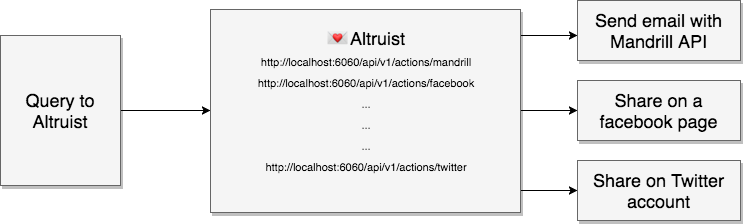

# 💌 Altruist

Gateway micro service for sharing content with ease ✌️

## ❓Why

Altruist is a bridge to a pletory of services. It acts as a server. All the wiring hard work has been done, no more:
  - manual coding of social services API,
  - reading outdated docs for each services you want to use,
  - comparing and finding the right module,
  - developing a new custom lib for a specific service.

It focuses on **Social Network** and **File SAAS** and it abstract the internal differences of all of this services.

If you need to share with one of the following [services](#list-of-available-actions), then 💌 Altruist is for you.

Simply connect your prefered account through the web server altruist provide and post your data to 💌 Altruist.

All the APIs have been meticulously integrated to respond to the same form of media POST to 💌 Altruist.

Currently 💌 Altruist supports the following data form POST:

* [x] `application/json` raw
* [x] `application/x-www-form-urlencode`
* [x] `multipart/form-data`



## 🌍 Installation as a binary

Install the tool:

```sh
$ yarn global add altruist
# or
$ npm install -g altruist
```

then, provide a settings file:

```sh
# get the template
$ wget https://raw.githubusercontent.com/soixantecircuits/altruist/master/settings/settings.example.json
# rename it
$ mv settings.example.json settings.json
# profit
$ altruist --settings settings.json
```

For details about what to write in the settings file, See the [Actions](#list-of-available-actions) section below.

Then, from a server, an app or POSTMAN you can post to:

```
POST http://localhost:6060/api/v1/actions/{ACTION_NAME}
```

## 👋 Usage

One action = one service

##### List of available actions:

* [mailchimp](/docs/mailchimp.md)
* [mandrill](/docs/mandrill.md)
* [facebook](/docs/facebook.md)
* [twitter](/docs/twitter.md)
* [slack](/docs/slack.md)
* [dropbox](/docs/dropbox.md)
* [google drive](/docs/googledrive.md)
* [youtube](/docs/youtube.md)
* [instagram](/docs/instagram.md)
* [mailjet](/docs/mailjet.md)
* [smtp](/docs/smtp.md)
* [scp](/docs/scp.md)
* [ftp](/docs/ftp.md)
* [1000mercis](/docs/1000mercis.md)
* [socialite](/docs/socialite.md)
* [print](/docs/print.md)

⚠️  *Some actions may require that you log in before using them. You can get a list of those actions with their login url by sending a GET request to the url matching `authRedirect` in the settings file (`/authRedirect` by default).*

##### Tests

You can check your action URLs and authentication URLs availability by running `npm test`.
_You will have to start your altruist server before running the test._

## 🕳 Troubleshoot

#### POSTMAN + MULTER
You can meet some issue while uploading file and JSON. This is a bug in POSTMAN. See here:
https://github.com/postmanlabs/postman-app-support/issues/2602
A way to fix it is to close and reopen the tab you are using to test the query. (http://stackoverflow.com/questions/35851660/multer-req-file-always-undefined/38461398#38461398)

## ❤️ Contribute

Thanks for helping us! 👏

Please follow:

* [JavaScript standard style](http://standardjs.com/)
* [This git branching model](http://nvie.com/posts/a-successful-git-branching-model/)

Please use the `develop` branch if you want to contribute.
